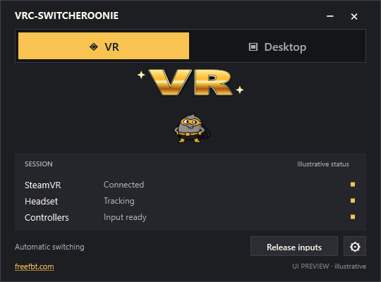
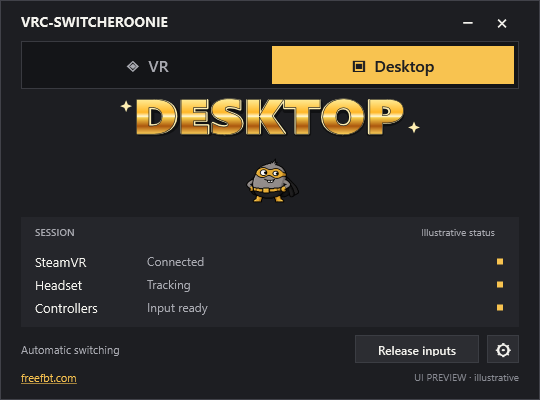
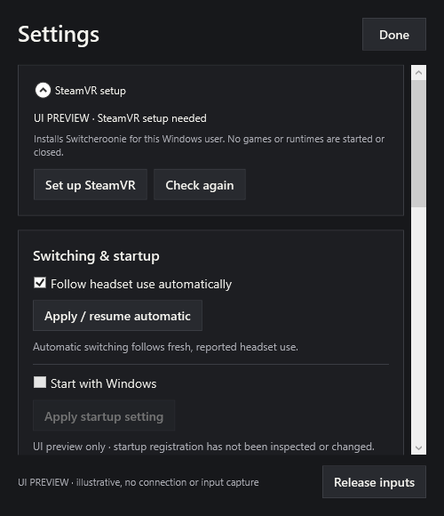
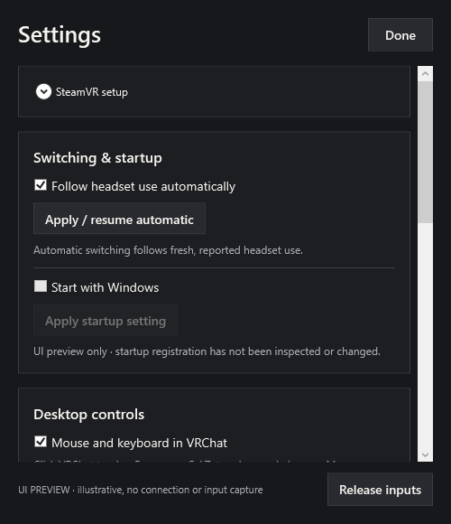
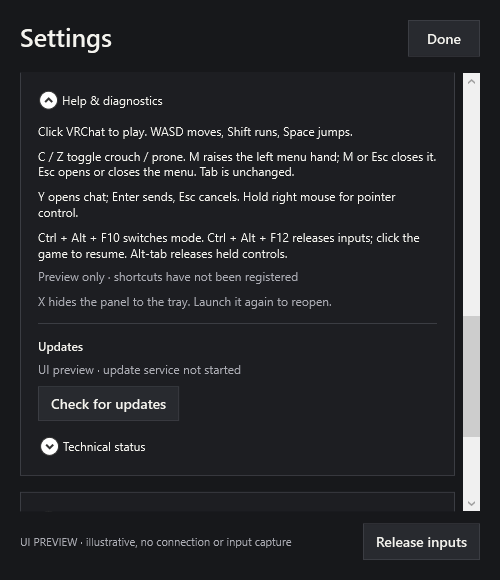
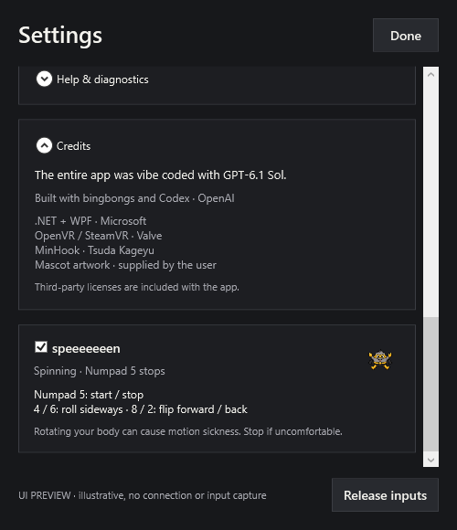

# VRC-SWITCHEROONIE

A small Windows app for switching an existing SteamVR VRChat session between your headset and mouse/keyboard controls.

**Experimental.** The first test route is PICO Swan through Virtual Desktop with physical controllers. Tracking uses SteamVR device classes and roles rather than vendor names; Steam Link, PICO Connect and other routes need their own live tests. Start VRChat in VR and keep the PCVR connection alive. Headset-free VRChat startup and converting an existing native desktop session into VR are still under development.




## Download and start

[**Download VRC-SWITCHEROONIE for Windows**](https://github.com/bingbongs/VRC-SWITCHEROONIE/releases/latest/download/VRC-SWITCHEROONIE-Portable.zip)

1. Extract the ZIP. Double-click **VRC-SWITCHEROONIE.exe**.
2. If **Set up SteamVR** appears, close VRChat and SteamVR normally, then click the setup button in Settings. No terminal commands or administrator prompt.
3. Connect your PCVR app, launch SteamVR through it, then launch VRChat in VR. Choose **Desktop** in SWITCHEROONIE and click into VRChat. Choose **VR** to switch back.

The download has one app EXE and an **App** folder. Keep them together. All app dependencies, including the .NET runtime and native libraries, are bundled: no .NET, Visual Studio or C++ runtime installation is needed. SteamVR, VRChat and your usual PCVR connection must already be available.

For full-body tracking, turn off **Freeze Tracking on Disconnect** in VRChat's Tracking & IK settings. Otherwise VRChat can keep your last tracked body pose when Desktop suspends the trackers. SWITCHEROONIE leaves your VRChat settings under your control.



Closing the panel keeps it in the tray. **Start with Windows** opens it quietly at sign-in. Updates download automatically. To apply one, close VRChat and SteamVR normally, choose **Quit VRC-SWITCHEROONIE** in the tray, wait a few seconds, then reopen the app. No installer or forced game restart.

The driver currently accepts SteamVR build **25330290**. Other builds refuse activation until reviewed. See [compatibility](docs/compatibility.md) and [recovery](docs/recovery.md).

## Controls

| Control | Action |
|---|---|
| Mouse | Look around after clicking into VRChat |
| WASD / Shift / Space | Move / run / jump |
| C / Z | Toggle crouch / prone; press again to stand |
| M | Raise the left hand and open the Quick Menu; press again to close and lower it |
| Esc | Open or close the same menu; cancel chat while typing |
| Left mouse | Select, use, or drag |
| Hold right mouse | Aim the interaction pointer |
| Hold middle mouse | Grab |
| Y / Enter | Open chat / send |
| Ctrl + Alt + F10 | Switch VR / Desktop while the panel is running |
| Ctrl + Alt + F12 | Release inputs and stop speeeeeeen |
| Alt-Tab | Release controls; click back into VRChat to resume |

**Tab keeps its normal game behavior.** Menu navigation keeps head look steady while the mouse aims the right hand. The left menu hand stays raised until the menu closes. Mouse look hides the Windows cursor; menu and pointer controls show it.



## speeeeeeen

Enable **speeeeeeen** below Credits in Settings. The choice is remembered; motion starts inactive each time.

| Number pad | Action |
|---|---|
| 5 | Turn spinning on or off |
| 4 / 6 | Roll sideways |
| 8 / 2 | Flip forward / backward |

Rotation builds speed while held and slows down after release. The opposite direction brakes faster. Num Lock can be on or off. Controls work in VR and Desktop while VRChat is foreground; typing, focus loss and emergency release stop motion.

**May cause motion sickness.** Start slowly. In Desktop, spinning rotates the held view, controllers and generic body trackers around a body pivot. In VR, it rotates the hands/body while your headset keeps its natural physical view. Avatar behavior depends on VRChat's IK and is experimental; it does not change avatar files or calibration.

Desktop suspends SteamVR generic body trackers so VRChat can use its non-FBT animation; VR restores their physical poses. On the PICO Swan / Virtual Desktop route, the user confirmed both fallback and restoration after disabling VRChat's freeze setting. Cursor hiding, wrist aiming and VRChat's locomotion animation after switching still need repairs/live verification. OSC-only body trackers sent directly to VRChat need a separate sender/relay path.




## Updates

[GitHub Releases](https://github.com/bingbongs/VRC-SWITCHEROONIE/releases) hosts the update files. The updater verifies a signed manifest and every packaged file, stages each version separately, and retains the previous version for recovery. It never replaces a loaded driver or closes VRChat, SteamVR, or Virtual Desktop. See [update details](docs/updates.md).

Use **VRC-SWITCHEROONIE-Portable.zip** for the simple download. The versioned win-x64 ZIP and manifest/signature are also retained for existing automatic updaters.

Version 0.2.4 makes the background service exit with the panel's explicit Quit command. An already-running service from 0.2.3 or older needs a one-time normal Windows restart before this new exit behavior can apply.

## Build

Windows x64, .NET SDK 10, CMake 3.25+, and Visual Studio Build Tools 2022 with C++ and the Windows SDK are required.

```powershell
powershell -NoProfile -ExecutionPolicy Bypass -File .\tools\Build.ps1
```

OpenVR and MinHook revisions are pinned in `third_party`. [Testing](docs/testing.md) distinguishes automated checks from headset and game testing. Screenshots show the app's own rendered UI with illustrative connection states.

## Credits

**Entirely vibe coded using 6.1 sol.** Built with OpenAI Codex and collaborating coding agents, directed and tested by **bingbongs**.

- Microsoft .NET / WPF and Windows APIs — desktop app and controls.
- Valve OpenVR — SteamVR interfaces.
- TsudaKageyu MinHook — native hook library.
- GitHub Releases — source hosting and portable update delivery.
- OpenAI image generation and user-supplied artwork — mascot development; the included mascot atlas is the user's supplied reference.
- [freefbt.com](https://freefbt.com)

MIT licensed; bundled dependencies retain their own licenses. See [third-party notices](THIRD_PARTY_NOTICES.md). This project is independent of VRChat, Valve, PICO and Virtual Desktop.
